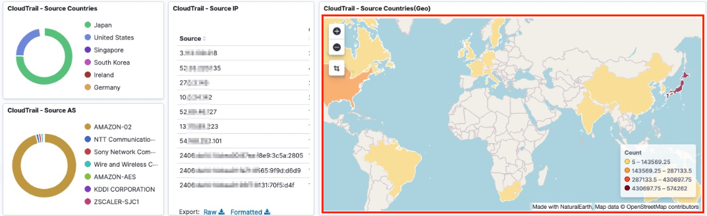

# Deploying SIEM with AWS CDK

language : [Korean](docs/README_kor.md)

## Architecture


## Notices
* This project includes implementing SIEM on AWS to monitor triggered events in the Centralized log bucket.
* For Log Source configuration, refer to [here](./docs/configure_aws_service.md) to see how to configure Log source for AWS Services.
* The list of supported Log Type is as follows.

|       |AWS Service|Log|
|-------|-----------|---|
|Security, Identity, & Compliance|AWS Security Hub|Security Hub findings<br>GuardDuty findings<br>Amazon Macie findings<br>Amazon Inspector findings<br>AWS IAM Access Analyzer findings|
|Security, Identity, & Compliance|AWS WAF|AWS WAF Web ACL traffic information<br>AWS WAF Classic Web ACL traffic information|
|Security, Identity, & Compliance|Amazon GuardDuty|GuardDuty findings|
|Security, Identity, & Compliance|AWS Network Firewall|Flow logs<br>Alert logs|
|Management & Governance|AWS CloudTrail|CloudTrail Log Event|
|Networking & Content Delivery|Amazon CloudFront|Standard access log<br>Real-time log|
|Networking & Content Delivery|Amazon Route 53 Resolver|VPC DNS query log|
|Networking & Content Delivery|Amazon Virtual Private Cloud (Amazon VPC)|VPC Flow Logs (Version5)|
|Networking & Content Delivery|Elastic Load Balancing|Application Load Balancer access logs<br>Network Load Balancer access logs<br>Classic Load Balancer access logs|
|Storage|Amazon Simple Storage Service (Amazon S3)|access log|
|Database|Amazon Relational Database Service (Amazon RDS)<br>(**Experimental Support**)|Amazon Aurora(MySQL)<br>Amazon Aurora(PostgreSQL)<br>Amazon RDS for MariaDB<br>Amazon RDS for MySQL<br>Amazon RDS for PostgreSQL|
|Analytics|Amazon Managed Streaming for Apache Kafka (Amazon MSK)|Broker log|
|Compute|Linux OS<br>via CloudWatch Logs|/var/log/messages<br>/var/log/secure|
|Containers|Amazon Elastic Container Service (Amazon ECS)<br>via FireLens|Framework only|

Experimental Support: We may change field type, normalization and something in the future.


## 1. Setting Up CDK Execution Environment

### 1.1. On Local
   ```shell
   git clone https://github.com/aws-samples/deploying-siem-with-aws-cdk.git
   cd siem-on-aws
   npm install
   ```
### 1.2. With EC2

1. Launch an Intance with Amazon Linux 2 AMI on EC2 console. (select **higher** instance type than *t2.micro*)
1. Create EC2 role with Admin Policy and attach it to the EC2.
1. Connect the instance.
1. Use the script below to install the required modules and clone repository.
   ```shell
    sudo yum groups mark install -y "Development Tools"
    sudo yum install -y amazon-linux-extras
    sudo amazon-linux-extras enable python3.8
    sudo yum install -y python38 python38-devel git jq
    sudo update-alternatives --install /usr/bin/python3 python3 /usr/bin/python3.8 1
    sudo update-alternatives --install /usr/bin/pip3 pip3 /usr/bin/pip3.8 1
    git clone https://github.com/aws-samples/deploying-siem-with-aws-cdk.git
   ```

## 2. Set environment variables

```shell
export CDK_DEFAULT_ACCOUNT=<AWS_ACCOUNT> # your AWS account
export AWS_DEFAULT_REGION=<AWS_REGION> # region where the distributable is deployed
```
Example)
```shell
export CDK_DEFAULT_ACCOUNT=888888888888
export AWS_DEFAULT_REGION=ap-northeast-2
```

## 3. Create Lambda Deployment Packages

Lambda in this project uses a 3rd party library GeoLite2.
Execute the below to download the library and create deployment packages locally.

```shell
cd siem-on-es-aws/deployment/
chmod +x ./step1-build-lambda-pkg.sh && ./step1-build-lambda-pkg.sh
```

## 4. Set up CDK environment

The script below installs the software required to run aws-cdk.
When proceeding locally "Do you really continue?" is exposed, enter 'y' and proceed.

```bash
chmod +x ./step2-setup-cdk-env.sh && ./step2-setup-cdk-env.sh
source ~/.bash_profile
```

## 5. CDK bootstrap

```bash
cd ..
cdk bootstrap
```

* If an error occurs, verify that the EC2 instance's role has Administrator.

### 5-1. Update cdk.json

You can make the necessary changes by referring to the following information.
**s3_bucket_name 의 log, snapshot, geo** are mandatory entries.

| Parameter | Initial value | Description |
|------------|-------|-----|
| resource_suffix | [blank] | suffix to prevent duplication error of resources when re-deploy|
| aes_domain_name | aes-siem | Amazon Elasticsearch Service's domain name |
| s3_bucket_name | 3 S3 buckets to be created: You need to update [AWS Account ID] below |
| <font color="coral">*</font>log | aes-siem-<font color="coral">*[AWS Account ID]*</font>-log | Bucket where centralized logs are stored  |
| <font color="coral">*</font>snapshot | aes-siem-<font color="coral">*[AWS Account ID]*</font>-snapshot | Bucket where ndjson imported is stored |
| <font color="coral">*</font>geo | aes-siem-<font color="coral">*[AWS Account ID]*</font>-geo | Bucket for which GeoIp mmdb will be downloaded |
| kms_cmk_alias | aes-siem-key | AWS KMS CMK(customer-managed key) alias |


### 5-2. validate json

After running, json is displayed and no errors are present, then normal.

```shell
cdk context  --j
```

## 6. CDK deploy
### 6-1. without GeoLite2

```bash
cdk deploy
```
### 6-2. with GeoLite2 (optional)
If you want to use the geo information through GeoIP as shown the dashboard below in Kibana, follow the procedure below.


1. Enter the license key using the GeoLite2LicenseKey parameter with cdk deploy.
    ```bash
    cdk deploy --parameters GeoLite2LicenseKey=xxxxxxxxxxxxxxxx
    ```
1. You can create the license key [here](https://dev.maxmind.com/geoip/geolite2-free-geolocation-data)
   * Sign Up for GeoLite2 -> Login -> Generate a License Key
1. The deployment takes about 20 minutes.
1. Test aes-siem-geoip-downloader lambda (with GeoLite2)
    1. Go to Lambda console
    1. Go to Test tab.
    1. Click Test.
    1. Go to S3 condole and see if GeoLite2 folder is created in aes-siem-*[AWS Account ID]*-geo bucket.

## 8. Update ES Access policy
1. Go to Elasticsearch Service console
1. Click domain aes-siem > Actions > Modify access policy
1. Specify the list to allow in aws:SourceIp

## 9. Go to Kibana
1. See Outputs tab in the stack you delployed
1. Go to the KibanaUrl (accessible only from sourceIp specified in #8)
1. Log in with KibanaAdmin/KibanaPassword in the Outputs tab
   * If you cannot log in with the KibanaAdmin/KibanaPassword, create a master user with aes-siem domain > Actions > Modify authentication in Elasticsearch Service console
1. Select Global as your tenant  
1. Select Dashboard Menu and verify that the dashboards are configured per AWS services
   * If you proceed with "#6-1 without GeoLite2", it is normal that the data on Geo related panel is not displayed
   
## 10. Cleanup
1. Go to CloudFormation console and click 'delete stack'
1. The resources below must be deleted by moving to the console of the service.
   * Amazon ES domain: aes-siem<font color="grey">{resource_suffix}</font>
   * Amazon S3 bucket: aes-siem-[AWS_Account]-log<font color="grey">{resource_suffix}</font>
   * Amazon S3 bucket: aes-siem-[AWS_Account]-snapshot<font color="grey">{resource_suffix}</font>
   * Amazon S3 bucket: aes-siem-[AWS_Account]-geo<font color="grey">{resource_suffix}</font>
   * AWS KMS customer-managed key: aes-siem-key<font color="grey">{resource_suffix}</font>
     - <font color="coral">**Note**</font>: If you delete the customer-managed key (CMK), you will not be able to read the logs that you encrypted using it.

   
## 11. Redeploy
* To <font color="coral">redeploy this stack</font>, update the **resource_suffix** in **cdk.json** and proceed from #6

## License
This product uses GeoLite2 Data created by MaxMind and is licensed under https://www.maxmind.com/en/geolite2/eula incorporating CC-BY-SA, available from https://www.maxmind.com.
This product uses ndjson and is licensed under BSD-3-Clause, available from http://ndjson.org/
